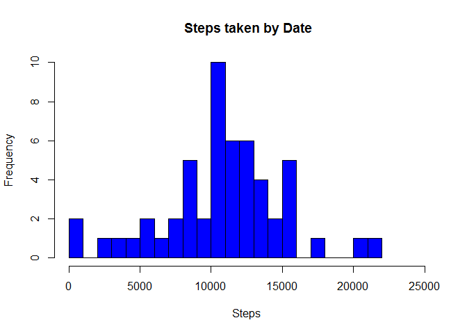
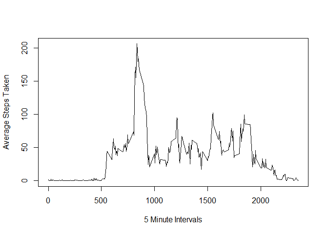
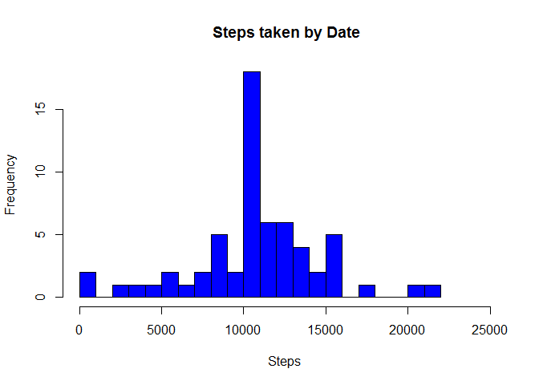
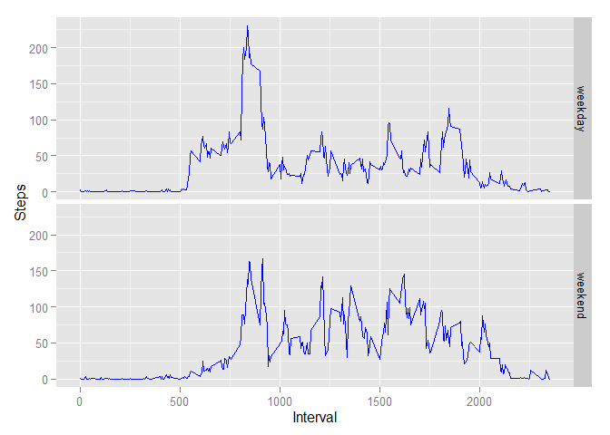

# Reproducible Research: Peer Assessment 1
Robert W. Stein  
Sunday, July 19, 2015  

##Loading and preprocessing the data.
Load libraries needed for the analysis.

```r
library(plyr)
library(dplyr)
```

```
## 
## Attaching package: 'dplyr'
## 
## The following objects are masked from 'package:plyr':
## 
##     arrange, count, desc, failwith, id, mutate, rename, summarise,
##     summarize
## 
## The following object is masked from 'package:stats':
## 
##     filter
## 
## The following objects are masked from 'package:base':
## 
##     intersect, setdiff, setequal, union
```

```r
library(ggplot2)
```
Retrieve the data needed for this analysis and prepare it for usage.

```r
unzip("download.zip")
activity_data <- read.csv("activity.csv")
```

##What is the mean total of steps taken per day?
Create a summary table of the steps taken each day.

```r
ActivitySteps <- aggregate(activity_data$steps, list(activity_data$date), sum)
colnames(ActivitySteps) <- c("Date", "Steps")
```
Create a histogram of the steps taken per day.

```r
hist(ActivitySteps$Steps,breaks=20,col="blue",main=" Steps taken by Date",
     xlab="Steps",xlim=c(0,25000))
```

 


Display the mean of the steps taken each day, ignoring days where the data is
missing.

```r
mean(ActivitySteps$Steps, na.rm=TRUE)
```

```
## [1] 10766.19
```
Display the median of the steps taken each day, ignoring days where the data is
missing.

```r
median(ActivitySteps$Steps, na.rm=TRUE)
```

```
## [1] 10765
```
##What is the average daily activity pattern?
Create a plot for the daily activity pattern showing average number of steps
taken in each duration.  A temporary data frame is created for this and the
default column names are used to create the plot.

```r
dur_steps <- aggregate(activity_data$steps, list(activity_data$interval), mean,
     na.rm=TRUE)
plot(x ~ Group.1, data=dur_steps, type = 'l',
     xlab="5 Minute Intervals", ylab="Average Steps Taken")
```

 


What duration, on average, has the largest number of steps taken?

```r
max_steps = subset(dur_steps, steps$x == max(steps$x))
max_steps$Group.1
```

```
## [1] 835
```

##Imputing missing values.
How many intervals are missing the number of steps?

```r
nrow(count(activity_data, vars="steps", wt_var="NA"))
```

```
## [1] 1
```

There are intervals where the number of steps is missing for various reasons.
To see what affect this has on the analysis imputed values will be introduce to
replace the missing data.

Create a copy of the original table for further analysis.  Also use the data of
steps duration created earlier to hold the values to be used for the imputed
data.  The ceiling() function is used to force a round-up of the the mean value
of the intervals.  The for{} loop uses the concept of the intervals being an
implied value of HH.MM to represent the time of day.  This allows the intervals
to be manipulated to create an index from 1-288 which represents the number of
5-minute intervals in a day.  The index is then used to replace the 'NA' data
with the mean for that 5-minute interval.

```r
amended_activity_data <- activity_data
amended_dur_steps <- cbind(dur_steps, ceiling(dur_steps[,2]))
```
Now fill in the steps showing 'NA' with the mean of the steps for the duration.

```r
for(i in 1:NROW(amended_activity_data)) {
    if(is.na(amended_activity_data[i,1] == "TRUE")) {
        inx_hr <- floor(amended_activity_data[i,3]/100)
        inx_min <- round((amended_activity_data[i,3]/100 - inx_hr) * 100 / 5)
        inx_dur = (inx_hr * 12) + inx_min + 1
        amended_activity_data[i,1] <- amended_dur_steps[inx_dur,3]
    }    
}
```
Create a histogram of the updated data to see how the imputed data affects the
outcome.  Also display the mean and median for the number of steps taken for
the updated data.

```r
ActivitySteps_new <- aggregate(amended_activity_data$steps, 
    list(amended_activity_data$date), sum)
colnames(ActivitySteps_new) <- c("Date", "Steps")
hist(ActivitySteps_new$Steps,breaks=20,col="blue",main=" Steps taken by Date",
    xlab="Steps",xlim=c(0,25000))
```

 

```r
mean(ActivitySteps_new$Steps)
```

```
## [1] 10784.92
```

```r
median(ActivitySteps_new$Steps)
```

```
## [1] 10909
```
These analyses, when compared to the previous results, show that replacing the
missing data with imputed values has an affect on the results.  In general, the
level of activity increases, as would be expected in this case.

##Are there differences in activity patterns between weekdays and weekends?
Produce an analysis of the updated data to see what the level of activity is for
weekdays versus weekends.

The data frame will be updated to contain a column indicating if the date
corresponds to a weekday or a weekend.

```r
amended_activity_data <- cbind(amended_activity_data,
    weekdays(as.Date(amended_activity_data[,2], "%Y-%m-%d")))
colnames(amended_activity_data) <- c("steps","date","interval","DayOfWeek")
amended_activity_data$DayOfWeek <- 
    ifelse(grepl('^S', amended_activity_data$DayOfWeek), "weekend", "weekday")
```
Now that the data has an indication of weekday or weekend, calculate the mean by
duration and weekday/weekend.

```r
DayTypeMean <- aggregate(amended_activity_data$steps, 
    list(amended_activity_data$DayOfWeek, amended_activity_data$interval), mean)
```
Create a panel plot showing the distribution of steps for each interval by
weekday and weekend.

```r
DayWeekPlot <- ggplot(data = DayTypeMean, aes(x = Group.2, y = x))  +
    geom_line(color = "blue") +
    labs(x = "Interval", y = "Steps")  +
    facet_grid(Group.1 ~ .)
print(DayWeekPlot)
```

 
